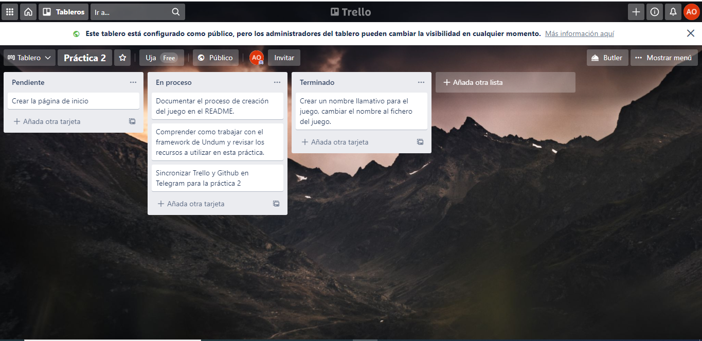
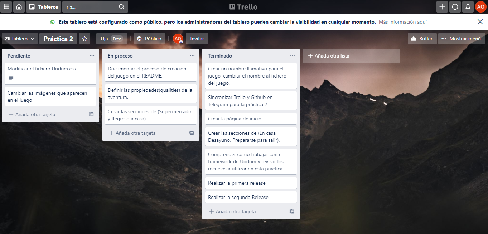
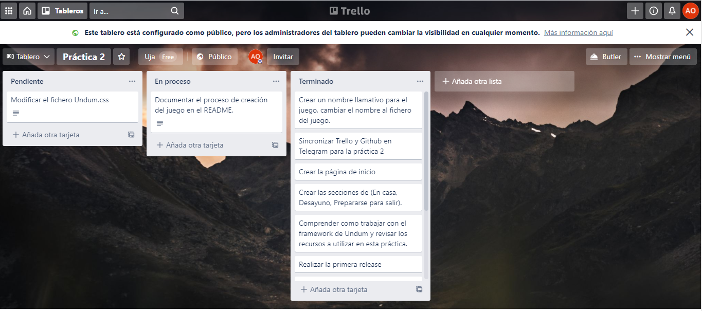
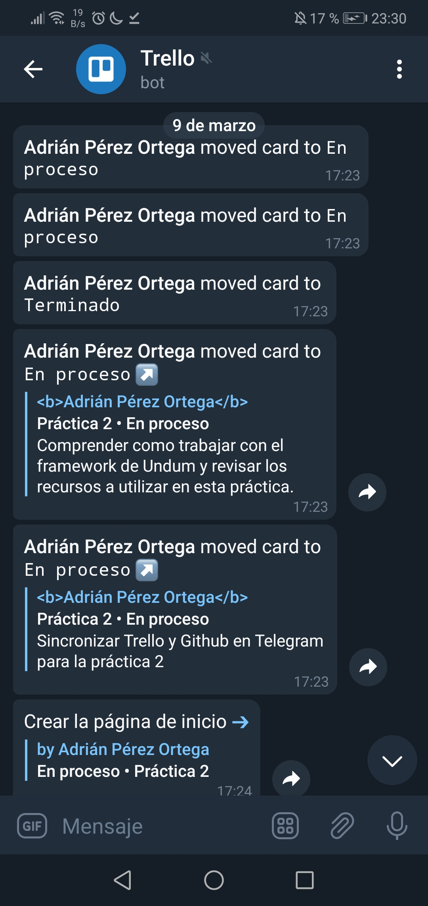
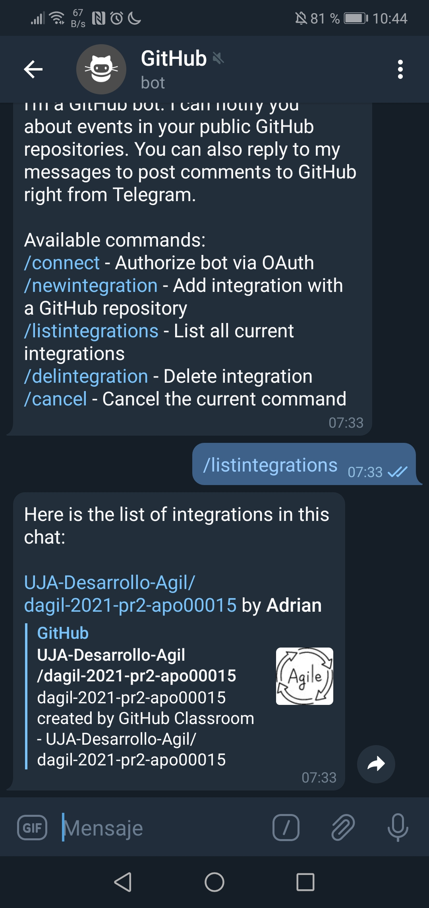

# Índice
   * [Descripción de la trama del juego y el personaje](#descripción-de-la-trama-del-juego-y-el-personaje)
   * [URL del tablero Trello](#url-del-tablero-trello)
   * [Capturas de pantalla en Trello](#capturas-de-pantalla-en-trello)
   * [Capturas de pantalla en la aplicación Telegram](#capturas-de-pantalla-en-la-aplicación-telegram)
   * 
El juego tiene las siguientes situaciones:
* **Start**: Es donde empieza el juego, es una pequeña introducción del día de hoy
* **Desayuno**: Es la situación en la que decides tomarte un desayuno y obtener energía.
* **Salir**: Es la situación en la que ya has tomado el desayuno y decides preparte para salir de casa.
* **Super**: Es la situación en la que estás en en supermercado y debes decidir que será lo que vas a comprar.
* **Regreso**: Es la situación final en la que ya has comprado lo que querías y te encuentras en casa.

##  Descripción de la trama del juego y el personaje
En este juego, serás un increible estudiante de ingeniería informática que se enfrentará a un rutinario día más de tu vida como estudiante.
Lo primero de todo saber que aparecerás en tu casa y tendrás en objetivo de ir a hacer la compra para poder comer hoy.

## URL del tablero Trello
https://trello.com/b/LoqBPgNW/pr%C3%A1ctica-2

## Capturas de pantalla en Trello
- **Imágen del tablero al empezar el proyecto**

- **Imágen del tablero a la mitad del proyecto**

- **Imágen del tablero al final del proyecto**

## Capturas de pantalla en la aplicación Telegram
- **Viculación con Github**

- **Viculación con Trello**

